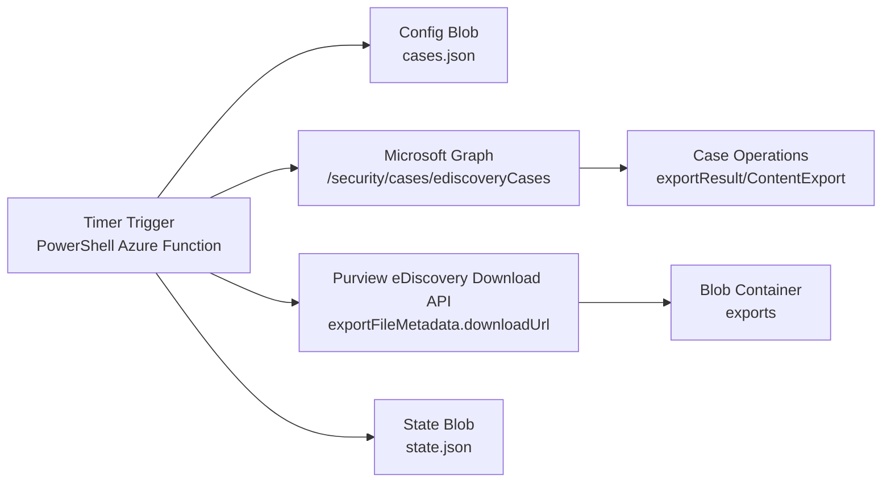

# Azure Purview eDiscovery Export Automation (PowerShell)

This project is now implemented as a PowerShell Azure Function (timer trigger).

It does the following on each run:

- Reads the list of enabled case names from a JSON config blob.
- Calls Microsoft Graph to resolve case names and list case operations.
- Filters completed export operations (`exportResult`, `ContentExport`).
- Downloads export files using the Purview eDiscovery download token.
- Uploads files to Blob Storage.
- Persists operation state to a JSON state blob so downloaded exports are skipped.

## Cost-effective architecture



Why this is cost-effective:

- Flex Consumption plan function app (no always-on compute).
- Single storage account for config, state, and downloaded exports.
- No queue, SQL, or Cosmos dependency for baseline polling workloads.

## Azure resources

- Function App (PowerShell, Flex Consumption plan)
- Storage account
  - Container `ediscovery-config` for `cases.json`
  - Container `ediscovery-state` for `state.json`
  - Container `exports` for downloaded packages
  - Container `deployment-packages` for Flex one-deploy packages
- Application Insights (recommended)

## App registration and permissions

Required app permissions:

- Microsoft Graph (application): `eDiscovery.Read.All` (or `eDiscovery.ReadWrite.All`)
- MicrosoftPurviewEDiscovery (application): `eDiscovery.Download.Read`
- Admin consent granted

Step-by-step setup (based on Microsoft guidance):

1. Register your app in Microsoft Entra ID.
  - Portal: Entra ID > App registrations > New registration.
  - Record values for:
    - `Application (client) ID`
    - `Directory (tenant) ID`
  - Create either:
    - a client secret (Certificates & secrets), or
    - a certificate credential.

2. Assign Microsoft Graph application permissions to your app.
  - Portal: App registrations > your app > API permissions > Add a permission > Microsoft Graph > Application permissions.
  - Add:
    - `eDiscovery.Read.All` (minimum), or
    - `eDiscovery.ReadWrite.All` (if write operations are required).
  - Select `Grant admin consent`.

3. Register the Microsoft Purview eDiscovery first-party service principal in your tenant.
  - This registers app ID `b26e684c-5068-4120-a679-64a5d2c909d9` (MicrosoftPurviewEDiscovery) in Enterprise Applications.
  - Example PowerShell:

```powershell
Connect-MgGraph -Scopes "Application.ReadWrite.All"
$spId = @{ AppId = "b26e684c-5068-4120-a679-64a5d2c909d9" }
New-MgServicePrincipal -BodyParameter $spId
```

4. Add MicrosoftPurviewEDiscovery API permission to your app.
  - Portal: App registrations > your app > API permissions > Add a permission > APIs my organization uses.
  - Search and select `MicrosoftPurviewEDiscovery`.
  - Choose `Application permissions`.
  - Add `eDiscovery.Download.Read`.
  - Select `Grant admin consent`.

5. Create/enable the app service principal in Purview permissions and assign roles.
  - If your app registration does not yet have an Enterprise Application object in the tenant, create the app service principal from the app registration client ID:

```powershell
Connect-MgGraph -Scopes "Application.ReadWrite.All"

$appClientId = "<Application (client) ID from your app registration>"
$appSp = Get-MgServicePrincipal -Filter "appId eq '$appClientId'"

if (-not $appSp) {
    $appSp = New-MgServicePrincipal -BodyParameter @{ AppId = $appClientId }
}

$appSp | Format-List Id,AppId,DisplayName
```

  - The `Id` returned above is the service principal object ID used for role assignment workflows.
  - Assign the app service principal in Purview (Security & Compliance PowerShell):

```powershell
Install-Module ExchangeOnlineManagement -Scope CurrentUser
Import-Module ExchangeOnlineManagement
Connect-IPPSSession

# Values from your app registration + enterprise app
$appClientId = "<Application (client) ID>"
$appObjectId = "<Enterprise Application Object ID>"
$displayName = "<Display Name>"

# Register the service principal inside Purview permissions model
New-ServicePrincipal -AppId $appClientId -ObjectId $appObjectId -DisplayName $displayName
Get-ServicePrincipal | Where-Object { $_.AppId -eq $appClientId }

# Assign eDiscovery roles
Add-RoleGroupMember -Identity "eDiscoveryManager" -Member $appObjectId
Get-RoleGroupMember -Identity "eDiscoveryManager"

Add-eDiscoveryCaseAdmin -User $appObjectId
Get-eDiscoveryCaseAdmin
```

  - If `New-ServicePrincipal` reports it already exists, continue with the role assignment commands.
  - Use Microsoft Purview permissions to assign the app to an eDiscovery role group that includes export/download capabilities.
  - At minimum, assign a role group appropriate for export workflows (commonly eDiscovery Manager, or a custom role group with equivalent permissions).
  - Ensure the admin doing role assignment has `Role Management` in Purview.

6. Configure function settings with the app identity.
  - Set `TENANT_ID`, `CLIENT_ID`, and `CLIENT_SECRET` (or certificate-based equivalent).
  - Keep `EDISCOVERY_APP_SCOPE` as `b26e684c-5068-4120-a679-64a5d2c909d9/.default` when using app-only export download.

Reference:

- https://learn.microsoft.com/en-us/purview/edisc-ref-api-guide#microsoft-purview-ediscovery-api
- https://learn.microsoft.com/en-us/graph/security-ediscovery-appauthsetup

Required API usage:

- `GET /security/cases/ediscoveryCases`
- `GET /security/cases/ediscoveryCases/{caseId}/operations`
- `GET /security/cases/ediscoveryCases/{caseId}/operations/{operationId}`
- Download from `exportFileMetadata.downloadUrl` with a retry sequence that prefers the Purview token, can use `PURVIEW_DOWNLOAD_SCOPE`, and falls back to anonymous access when the URL is already pre-signed

## Configuration

Copy `local.settings.sample.json` to `local.settings.json`.

Required settings:

- `AzureWebJobsStorage__accountName`
- `TENANT_ID`
- `CLIENT_ID`
- `CLIENT_SECRET`

Optional settings:

- `TIMER_SCHEDULE` (default: `0 */30 * * * *`)
- `CONFIG_CONTAINER` (default: `ediscovery-config`)
- `CONFIG_BLOB_NAME` (default: `cases.json`)
- `STATE_CONTAINER` (default: `ediscovery-state`)
- `STATE_BLOB_NAME` (default: `state.json`)
- `EXPORTS_CONTAINER` (default: `exports`)
- `GRAPH_SCOPE` (default: `https://graph.microsoft.com/.default`)
- `PURVIEW_SCOPE` (default: `https://api.purview.microsoft.com/.default`)
- `PURVIEW_DOWNLOAD_SCOPE` (default: `https://api.security.microsoft.com/.default`)
- `EDISCOVERY_APP_SCOPE` (optional, no default)
- `EXPORT_DOWNLOAD_SCOPE` (optional, no default)
- `ARIA2C_PATH` (optional, full path to `aria2c` executable; when set and valid, downloads use aria2c for parallel chunked transfer)

For production, use Function App settings and Key Vault references for `CLIENT_SECRET`.

### Optional download acceleration with aria2c

The function supports a fast path that uses `aria2c` for export package downloads.

- If `aria2c` is discoverable in `PATH`, or `ARIA2C_PATH` points to a valid binary, the function uses aria2c.
- Otherwise, it automatically falls back to the built-in HttpClient downloader.

Example app setting:

```text
ARIA2C_PATH=/home/site/wwwroot/tools/aria2c
```

Notes:

- Include the `aria2c` binary in your deployment package (for Linux Function Apps, use a Linux-compatible executable).
- The downloader uses parallel split settings (`--split=16`, `--max-connection-per-server=16`) tuned for large export files.

This repo now supports Key Vault reference mode by default in IaC.

## Config blob format

Blob path: `ediscovery-config/cases.json`

```json
{
  "cases": [
    { "caseName": "HR Investigation 2026", "enabled": true },
    { "caseName": "FIN 2026-04", "enabled": true }
  ]
}
```

You can start from `config/cases.sample.json`.

## State blob format

Blob path: `ediscovery-state/state.json`

The function stores a map of `caseId|operationId` with status and metadata. If an operation has `status = Downloaded`, it is skipped on future runs.

You can initialize this with `config/state.sample.json` if you want an explicit empty state blob.

## Local development

1. Install:
   - PowerShell 7+
   - Azure Functions Core Tools v4
2. Start function host:

```powershell
func start
```

For this Flex/Linux runtime, managed dependencies are not used. The function uses REST calls and managed identity for Storage access.

## Deployment

### Option A: One-command infra deployment (recommended)

Use the Bicep template and deployment wrapper to provision all Azure resources and app settings:

```powershell
.\scripts\deploy_infra.ps1 `
  -SubscriptionId "<subscription-id>" `
  -ResourceGroupName "rg-ediscovery-automation" `
  -Location "westus2" `
  -NamePrefix "ediscprod" `
  -TenantId "<tenant-id>" `
  -ClientId "<app-id>"
```

If `-Location` is omitted, the deploy script now defaults to `westus2`.

The script prompts securely for `ClientSecret` and deploys with `UseKeyVaultReference = true` by default.
You can override behavior:

```powershell
.\scripts\deploy_infra.ps1 ... -UseKeyVaultReference $false
```

Template files:

- `infra/main.bicep`
- `infra/main.parameters.example.json`

This deploys:

- Function App (PowerShell on Flex Consumption)
- Storage account
- Blob containers for config/state/exports
- Blob container for Flex deployment packages
- Application Insights
- Function App settings required by this app

Security detail:

- When `UseKeyVaultReference=true`, the template stores the secret in Key Vault and sets `CLIENT_SECRET` as an App Service Key Vault reference.
- The Function App managed identity is granted Key Vault Secrets User role on that vault.

Then publish code:

```powershell
func azure functionapp publish <function-app-name> --powershell
```

If `func` is not in your PATH on Windows, use the full path:

```powershell
"C:\Program Files\Microsoft\Azure Functions Core Tools\func.exe" azure functionapp publish <function-app-name> --powershell
```

If publish fails with storage authentication/network errors, verify the deployment storage account allows connectivity from your publish environment.

### Option B: Manual deployment

1. Provision Function App + Storage account.
2. Deploy with `func azure functionapp publish <function-app-name> --powershell` or CI/CD.
3. Set app settings from `local.settings.sample.json`.
4. Seed `cases.json` in the config container.
5. Verify execution via Application Insights logs.

To seed config quickly from local case names:

```powershell
.\scripts\seed_case_config.ps1 -StorageConnectionString "<conn-string>" -CaseNames "HR Investigation 2026","FIN 2026-04"
```

## Operations

- Update case list by editing `cases.json` only.
- Reprocess an export by removing that operation entry from `state.json`.
- Add blob lifecycle policies for retention and cost control.

### Monitoring and logs

For Linux Flex Consumption, Core Tools log streaming is not supported. Use Application Insights queries or Azure Portal Live Metrics.

Use Application Insights queries for recent traces/executions:

```powershell
az monitor app-insights query `
  --app <app-insights-name> `
  --resource-group <resource-group> `
  --analytics-query "traces | where timestamp > ago(30m) | order by timestamp desc | project timestamp, message, severityLevel | take 50"
```

```powershell
az monitor app-insights query `
  --app <app-insights-name> `
  --resource-group <resource-group> `
  --analytics-query "requests | where timestamp > ago(60m) | where name contains 'EdiscoveryPoll' or operation_Name contains 'EdiscoveryPoll' | order by timestamp desc | project timestamp, name, resultCode, success, duration | take 20"
```

To check the most recent failures quickly:

```powershell
az monitor app-insights query `
  --app <app-insights-name> `
  --resource-group <resource-group> `
  --analytics-query "exceptions | where timestamp > ago(60m) | where operation_Name contains 'EdiscoveryPoll' | order by timestamp desc | project timestamp, outerMessage, innermostMessage | take 20"
```

If your Azure CLI prompts for an extension, you can enable automatic install:

```powershell
az config set extension.use_dynamic_install=yes_without_prompt
```

## Notes

- Case name matching is exact (case-insensitive).
- Downloads are staged to a temp file before upload to blob.
- Temporary file staging uses `TEMP`, then `TMP`, then `/tmp` fallback.
- This is polling-based. If volume grows significantly, split into discovery + queue + worker functions.

## Recent reliability update

- Download logic now uses streamed `HttpClient` transfer (`ResponseHeadersRead`) instead of relying on `Invoke-WebRequest` response object shapes.
- This avoids runtime differences where `StatusCode`/`BaseResponse` may be missing in Azure Functions PowerShell.
- The streamed path also reduces memory pressure for large export files.

### Latest validation outcome

- Downloaded operation `850e3a8428444d6094f7d9a3b849c732` with 3 files.
- Successful download sizes in telemetry:
  - `988715008` bytes
  - `88283136` bytes
  - `1223314` bytes
- Scope used successfully: `b26e684c-5068-4120-a679-64a5d2c909d9/.default` (role `eDiscovery.Download.Read`).
